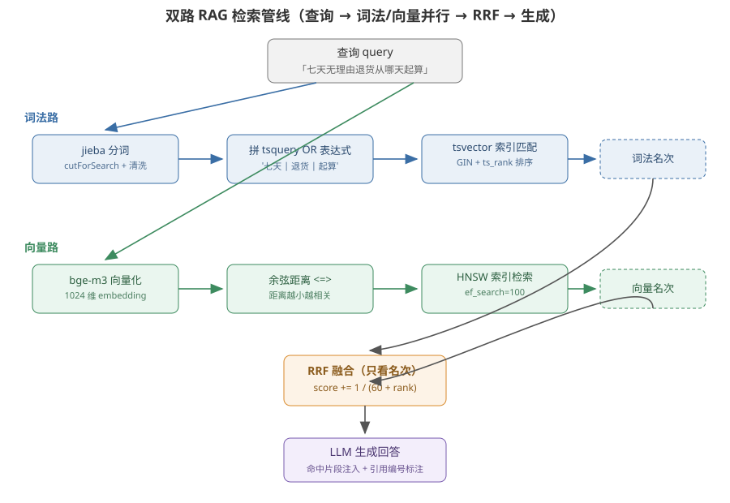

# RAG 从零到双路召回

本项目是电商数字员工平台，核心能力之一是根据平台规则与法规回答商家问题。模型训练数据有截止日期，也会编造不存在的条款，所以回答必须回到一批可追溯的原文上。做法是：把 50 篇电商规则/法规语料切成小块，建立**词法 + 向量两套索引**，查询时双路并行召回、按名次融合，把命中片段注入生成并标注引用编号。降级、评测、租户隔离都建立在这条检索主线上。

本文按六个阶段把 RAG 搭起来：先跑通一条最小检索，再逐个补上中文分词、词法路、向量路，然后把两路融合，最后处理 embedding 不可用时的降级。每阶段只补全景图里的一块。

> 阅读起点：熟悉 HTTP 与 TypeScript 即可。pgvector、tsvector、embedding 会在用到时解释。本文面向本仓库实现，源码路径以 `apps/api/src/` 为根。

## RAG 原理全景

RAG 是 Retrieval-Augmented Generation，检索增强生成。把一次「用知识库回答问题」拆成三步：

```text
查询 query
  → 检索 retrieve：从知识库里找出最相关的若干片段
  → 增强 augment：把这些片段拼进提示词，让模型看着原文回答
  → 生成 generate：模型输出回答，并标注「答案来自第几段原文」
```

不用 RAG 直接问模型，模型会凭训练记忆回答，可能引用不存在的条款、给不出出处，也拿不到平台最新规则。RAG 把「答案依据」从模型参数里搬到可检索的外部语料里，回答因此可溯源、可更新、可审计。

解决「模型不知道最新规则」有几种方案，RAG 是其中之一：

| 方案 | 做法 | 问题 |
| --- | --- | --- |
| 微调 | 把知识训进模型权重 | 规则一更新就要重训，成本高，数字仍可能记错 |
| 长上下文 | 把全部语料塞进提示词 | 上下文窗口有限，成本随语料增长，关键句被淹没 |
| RAG | 只把最相关的几段塞进提示词 | 检索质量决定回答上限，本项目就在解决检索质量 |

检索这一步可以拆成两个动作，后面所有评测指标都建立在这两个动作上：

- **召回（recall）**：把相关的片段都找出来，宁多勿漏。召回漏掉的，后面永远救不回来。
- **排序（ranking）**：把最相关的排到最前面。召回全了，还要让「对的那个」位置靠前，否则模型看到一堆噪声。

先保证召回、再优化排序，是这个项目检索设计的主线。

本项目的知识库单元是 **chunk（块）**，不是整篇文档。一篇规则可能有几千字，整篇塞进提示词又贵又容易淹没关键句，而且检索粒度太粗——命中一篇几千字的文档，生成时还是要自己在里面找答案。切成块后，检索命中的就是「含答案的那一小段」。

块的大小是个权衡：块太小（一句话）会切断上下文，一个条款拆成几块、语义不完整；块太大又回到文档粒度，检索不准。本项目取 600 字符左右、相邻重叠 100 字符，是这个平衡点。检索命中的是块，生成时引用的是块里的原文。

双路检索是这个项目的核心设计。单路检索各有一个盲区：

| 单路方案 | 擅长 | 盲区 |
| --- | --- | --- |
| 词法检索（关键词/全文） | 精确术语、数字、编号：`168小时` `退一赔十` `第二十五条` | 换一种说法就搜不到：问「买错了能退吗」搜不到「七天无理由退货」 |
| 向量检索（embedding 语义） | 近义、改写、跨文档语义相近 | 精确数字与专有名词容易漂：`48小时` 与 `24小时` 向量距离可能很近 |

两个盲区正好互补，所以本项目把两条路都建起来，查询时并行召回、再融合排序。下面是全景：



三个贯穿全文的结论先放在这里：中文必须自己做分词，Postgres 默认把连续中文当一个词；词法分数和向量分数不在一个量纲上，融合只能看名次；降级是改一行路由数据，不是写 if-else 分支。

## 实现思路

### 要保证什么

回答要有据可查、换种问法也能命中、精确数字不能错，同时 embedding 供应商挂掉时检索不能整体瘫痪。

### 为什么简单方案不够

单路检索各有盲区（上表）。纯词法对改写问法召回差，纯向量对精确数字召回差。把两路都跑一遍看似浪费，但两路命中的是不同性质的 chunk，融合后比任何单路都全。

两路的分数不可直接比较。向量路返回余弦距离（越小越相关，量级在 0~1 之间），词法路返回 `ts_rank`（越大越相关，量级随匹配数变化）。拿 0.2 的距离和 0.8 的 rank 比大小没有意义。所以融合时不看分数，只看「这块在这条路里排第几」。

### 四个设计决定

1. **先复用双索引，再决定怎么融合。** 检索单元是 chunk；先让每条路各自独立返回「有序的 chunk 列表」，融合层只消费列表里的名次，不关心每条路内部怎么算分。
2. **两路并行、互不拖累。** 查询时两路同时跑，任一路失败用 `Promise.allSettled` 收口成空路，另一路照常返回。
3. **融合用名次不用分数。** RRF（Reciprocal Rank Fusion）对每块累加 `1/(k+rank)`，k 取 60。这是 Elasticsearch 同款做法。
4. **降级靠数据不靠代码。** 通道语义是 `auto` / `vector` / `lexical` 三个值，`auto` 在 embedding 不健康时自动走纯词法。禁用 embedding 只需把路由表里 `embedding` 那行置为不可用。

## 一 一次查询实际发生了什么

检索的入口是 `RetrievalService.hybridSearch`，签名如下：

```ts
hybridSearch(opts: {
  enterpriseId: number
  query: string
  topK?: number        // 默认 8
  channel?: 'auto' | 'vector' | 'lexical'  // 评测用后两者做消融
}): Promise<RetrievalHit[]>
```

一次 `channel='auto'` 的调用分四步：

```text
query
  ├─ 词法路：jieba 分词 → tsquery → tsvector 索引 → 有序 chunk 列表
  └─ 向量路：bge-m3 向量化 → 余弦近邻 → 有序 chunk 列表
  → RRF 按名次融合成一张表
  → 截取 topK 返回
```

返回的每个命中项长这样：

| 字段 | 含义 |
| --- | --- |
| `chunkId` / `docId` | 命中的块 id 与所属文档 id |
| `content` | 块正文，生成时作为引用原文 |
| `vectorRank` / `lexicalRank` | 该块在向量路/词法路的名次，未参与的那路为 undefined |
| `rrfScore` | 融合得分，只看相对大小 |

`vectorRank` 和 `lexicalRank` 同时保留，是评测和前端可视化「双路各自命中第几」的依据，也是降级演练里判断「向量路是否真的没参与」的签名。

## 二 最小检索先跑通

先不管分词和向量，用词法单路跑通一次「召回 → 名次」的闭环。用项目里的手工装配入口（`apps/api/src/demo/bootstrap.ts` 的 `buildDemoServices`，tsx 直跑时 Nest DI 不产装饰器元数据，所以手动 new 依赖图）：

```ts
import { buildDemoServices } from './bootstrap'

const { retrieval, prisma } = await buildDemoServices()
const hits = await retrieval.hybridSearch({
  enterpriseId: 1,
  query: '七天无理由退货',
  channel: 'lexical',
  topK: 3,
})
for (const h of hits) {
  console.log(h.lexicalRank, h.content.slice(0, 40))
}
```

输出类似：

```text
1 「七天无理由退货」服务是指买家购买带有…
2 自物流显示签收商品的次日零时起计算，满168小时为七天…
3 消费者定作的、鲜活易腐的…
```

这里还没有向量路，`rrfScore` 退化为词法名次的折算分。先确认「能按相关性拿到有序原文」这一件事成立，再往下补分词和向量。

## 三 中文为什么必须自己分词

Postgres 的全文检索对英文友好：`to_tsvector('english', 'return the goods')` 能按空格和词干切出 `return` `good` 等词。中文没有空格，默认解析器会把连续汉字当成**一个** token：

```text
to_tsvector('simple', '七天无理由退货')  →  一个 lexeme「七天无理由退货」
to_tsvector('simple', '七天 无 理由')      →  三个 lexeme「七天」「无」「理由」
```

如果查询是「七天无理由」、语料里写的是「七天无理由退货」，前者切出的词和后者整串对不上，召回直接漏掉。所以分词责任必须上移到应用层，用 jieba 先切好，再交给 Postgres 的 `simple` 配置（`simple` 只做小写，不再切词）。

分词的入口是 `rag/tokenizer.ts`：

```ts
// cutForSearch：搜索引擎模式，长词进一步切细，兼顾精确与召回
const tokens = tokenize('七天无理由退货从哪天起算')
// → ['七天','无','理由','退货','从','哪天','起算']
```

切完还有两件事：清洗 tsquery 的特殊字符（`& | ! ( ) : ' " * ^ \` 这些在查询语法里是运算符，留在 token 里会被解析错），再把 token 拼成 OR 表达式：

```text
'七天 | 无 | 理由 | 退货 | 起算'
```

OR 而不是 AND，是因为 AND 太严容易空结果，OR 宽容匹配、再靠 `ts_rank` 排序把相关度高的排前面。

## 四 词法路

词法路用 Postgres 全文检索三件套：

| 部件 | 做什么 |
| --- | --- |
| `tsvector` | 把一段文本存成「词 + 位置」的索引列，入库时生成 |
| `tsquery` | 查询表达式，`@@` 运算符判断 tsvector 是否匹配 |
| `ts_rank` | 匹配相关度打分，排序用 |

入库时每个 chunk 的 `tsv` 列是 `to_tsvector('simple', 分词空格串)`；查询时 `tsv @@ to_tsquery('simple', '七天 | 退货')` 命中，再按 `ts_rank` 降序。给 `tsv` 建 GIN 索引加速。

```text
查询「七天无理由退货」
  → jieba 切词 → '七天 | 无 | 理由 | 退货'
  → tsv @@ to_tsquery('simple', ...)
  → ts_rank 排序 → 词法名次
```

诚实标注一点：`ts_rank` 不是 BM25，它衡量的是词频和覆盖度，没有文档长度归一化和 IDF 那套完整 BM25 公式。本项目能接受它，是因为融合层只用名次、不用分数绝对值，`ts_rank` 只要保证「更相关的排更靠前」就够。词法路的完整实现与 GIN 索引验证见 [01-中文分词与词法检索](01-中文分词与词法检索.md)。

## 五 向量路

向量路把「文字相关」变成「几何距离近」。embedding 模型把一段文本映射成高维向量，语义相近的文本向量夹角小、距离近。

本项目用 `bge-m3`：1024 维、中文表现好、且该供应商当前免费。查询时把 query 向量化，在向量索引里做余弦近邻：

```text
查询「七天无理由退货」
  → bge-m3 得到 1024 维向量
  → 与 chunk 向量算余弦距离 <=>
  → 距离升序 → 向量名次
```

余弦距离用 `<=>` 运算符，索引用 HNSW（`vector_cosine_ops`）。HNSW 是近似最近邻索引，靠 `ef_search` 参数在召回率和延迟之间权衡，本项目设 100。向量列的维度必须显式声明，HNSW 才能建索引，所以迁移里有 `ALTER COLUMN embedding TYPE vector(1024)` 这一步。向量路完整实现见 [02-向量检索与HNSW索引](02-向量检索与HNSW索引.md)。

## 六 双路 + RRF 融合

两路各自返回一张有序 chunk 表，融合要回答「综合两条路，哪块最该排前面」。

先定义名次（rank）：每条路把自己命中的 chunk 排好序，第 1 名、第 2 名、第 3 名……这个位置就是名次。RRF 只消费这个位置，不管这条路给的分数是 0.8 还是 0.2。

分数不可比是核心约束。向量路给余弦距离（0~1，越小越好），词法路给 `ts_rank`（无上界，越大越好），两者量纲不同。RRF 的解法是**只取名次，丢掉分数**：

```text
rrfScore(chunk) = Σ 1 / (60 + rank_in_each_path)
```

k=60 是经验常数（Elasticsearch 同款），作用是让第一名比第二名优势明显，又不至于让第一名独占全部权重。

手算一个例子。某 chunk 在词法路排第 1、在向量路排第 3：

```text
rrfScore = 1/(60+1) + 1/(60+3) = 1/61 + 1/63 ≈ 0.0164 + 0.0159 ≈ 0.0323
```

另一块只在词法路排第 2、向量路没进前 50：

```text
rrfScore = 1/(60+2) = 1/62 ≈ 0.0161
```

第一块两条路都命中，分数更高，排前面。若某路没命中某块，该路就不贡献这一项。

融合是纯函数 `rrfFuse`，放在应用层而不是 SQL：两路分库查询、量纲问题在应用层解决最直接，且单路时 RRF 自动退化为该路名次折算分，无需分支。三条通道的消融结果：

| 组 | Recall@5 | Recall@10 | MRR@10 |
| --- | --- | --- | --- |
| lexical（只词法） | 93.3% | 95.6% | 0.910 |
| vector（只向量） | 92.2% | 97.8% | 0.887 |
| auto（双路+RRF） | **97.8%** | **98.9%** | 0.904 |

auto 的 Recall@5 同时高于两条单路，证明双路互补不是把两个都跑一遍的浪费。数字口径与评测方法见 [03-入库管线与评测](03-入库管线与评测.md)。

## 七 降级语义

embedding 供应商可能限流、断网或 key 失效。检索不能因此整体失败，这是 `channel='auto'` 要解决的。

网关侧有一个 embedding 健康追踪器：连续 3 次失败进入 60 秒冷却，冷却期内 `embeddingHealthy()` 返回 false。检索服务据此决定向量路是否参与：

```text
channel='auto'
  → embeddingHealthy()?  否 → 只走词法路
  → 是 → 双路并行，但向量路若仍失败，allSettled 收口成空路
```

向量路失败时日志输出 `[DEGRADE] embedding unavailable, fallback to lexical`，命中的 chunk `vectorRank` 全部为 undefined、`lexicalRank` 有值。这是「纯词法降级」的可观测签名。

降级演练就是切一行路由数据：把 `model_routes` 里 `alias='embedding'` 的行置为 `enabled=false`，重跑同一查询，命中数不变、`vectorRank` 全空，证明检索没瘫。演练脚本是 `apps/api/src/demo/degradation.ts`。

## 八 增强与生成：检索结果怎么变成回答

检索拿到的是 top-K 个 chunk，模型要「看着它们回答」还差一步增强（augment）：把片段拼进提示词，给每个片段一个编号。生成时模型引用编号，答案就能追溯到原文。

增强后的提示词大致长这样：

```text
system：你是规则答疑客服，只依据下面片段回答并引用编号
片段：
[1] 「七天无理由退货」服务是指买家购买带有…
[2] 自物流显示签收商品的次日零时起计算，满168小时为七天…
[3] 消费者定作的、鲜活易腐的…
用户：七天无理由退货从哪天起算？
```

模型生成时引用编号：

```text
自物流签收商品的次日零时起计算，满168小时为七天[2]。
```

`[2]` 对应注入的第 2 个片段，前端据此点开原文。这就是 RAG 的「增强 + 生成」：模型没有背下条款，它只是把检索到的原文组织成回答。

增强有两条接入路径：

| 方式 | 触发 | 场景 |
| --- | --- | --- |
| INJECT | 每轮自动把 top-3 命中拼进 system 提示词 | 答疑客服直接带引用回答 |
| TOOL | 员工判断需要时主动调 `kb_search` 工具，拿原文片段再回答 | 查政策后还要做后续动作 |

两者都只做检索、不做摘要，保证引用的是原文。INJECT 在 `runtime/context-builder.ts`，TOOL 在 `skills/executors/builtin/kb-search.ts`。

把整条链路串起来走一遍：

```text
查询「七天无理由退货从哪天起算」
  → 双路检索 → top-3 chunk
  → 增强：片段拼进 system，编号 [1][2][3]
  → 生成：模型输出「自签收次日零时起算…[2]」
  → 溯源：点 [2] 看到原文 chunk
```

引用溯源是 RAG 相对「模型裸答」的关键差异：答案每一句都能定位到语料原文，这也是这个项目把检索当核心、而不是把「会聊天」当核心的原因。

## 核心链路之后

| 想弄清的问题 | 内容 |
| --- | --- |
| jieba 怎么分词、tsquery 怎么清洗、GIN 怎么验证 | [01-中文分词与词法检索](01-中文分词与词法检索.md) |
| embedding 是什么、HNSW 怎么调、维度怎么定 | [02-向量检索与HNSW索引](02-向量检索与HNSW索引.md) |
| 语料怎么入库、评测数字怎么算、有哪些局限 | [03-入库管线与评测](03-入库管线与评测.md) |

返回 [文档目录](../README.md)。
